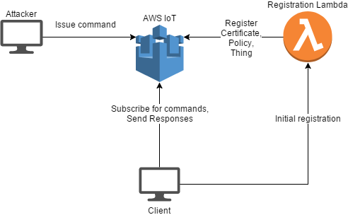

# AWS IoT-based CnC

## Design

The client registers within the HTTP-enabled lambda. The lambda, once triggered,
registers a new Thing, an IAM Policy, and a Certificate. 
Once the client is registered, it subscribes to its topic within the AWS IoT service and 
simply waits until the attacker issues a remote command to be executed.

## Deployment

The application is written with the Serverless Framework.

1. Verify that you have valid credentials in ~/.aws/credentials

2. Run the command `serverless deploy`