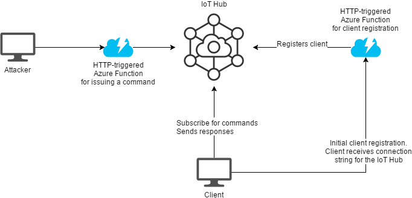

# About

The project contains one possible implementation of the azure-based CnC backend application.

# Possible implementations

## Logic

The logic can be easily implemented in Azure Functions, which as essentially the same as AWS Lambdas.

## Push notifications

* SignalR - push notification for the chat
  
  Introduction: https://docs.microsoft.com/en-us/aspnet/core/signalr/introduction?view=aspnetcore-2.2
  
  Difficult authentication (https://docs.microsoft.com/en-us/azure/azure-signalr/signalr-authenticate-azure-functions#log-into-azure-with-vs-code).
  It supports only:
  
  * Azure Active Directory
  * Facebook
  * Twitter
  * Microsoft account
  * Google
  
* IoT Hub
  * Super simple authentication
  * Possibility to register devices from Function
  * Remote method invocation
  * note very reliable - needed to implement the retry functionality, as some of my requests were simply lost somewhere
  
# Final Architecture

