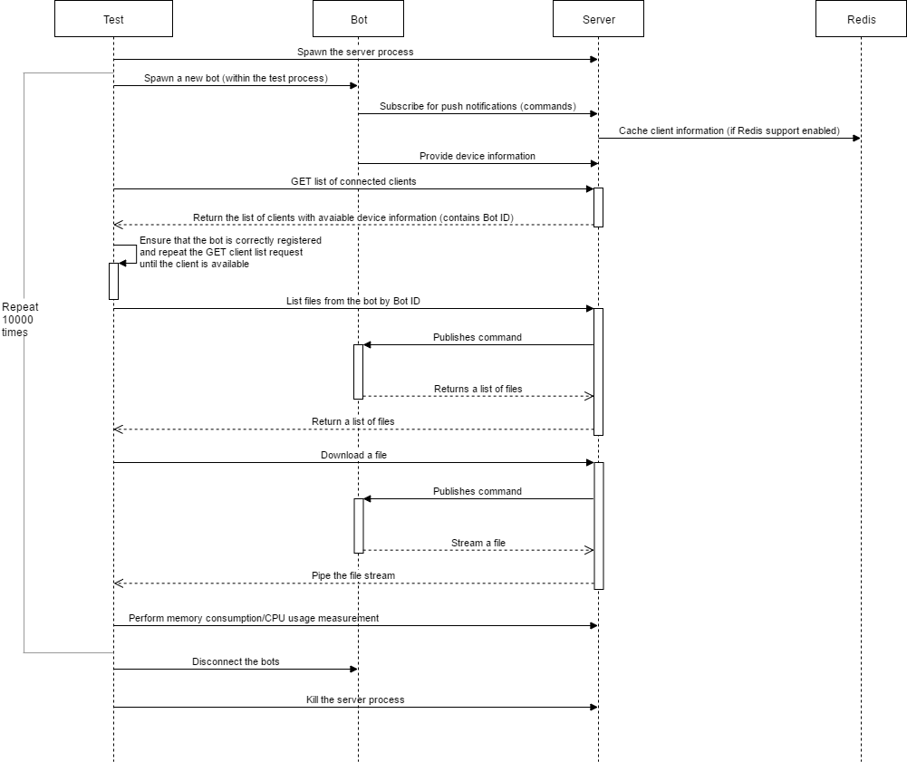

# About

Contains E2E test for the standalone approach.

# Unit Testing

You can run it with the following command

```commandline
npm run windowsTest
```

# Memory consumption

In order to evaluate how much memory the server uses depending on the number of clients connected to it
you can execute the following command

```commandline
npm run resourceConsumption
```

Alternatively if you want the server to use redis, you can use the following command

```commandline
npm run resourceConsumption --redis.host=<redis_host> --redis.port=<redis_port>
```

The testing is done as follows: 



# Execution speed

In order to evaluate the execution speed, first run the standalone server. Note, that the server application
should run on a remote host. Only this way you can eliminate the bias related to non-existent network latency,
which will exist in case of later cloud-based measurements.

Run the command

```commandline
node performanceTest.js --output ./performance.csv --clients 100 --urlBase http://localhost:666 --port 666 
```